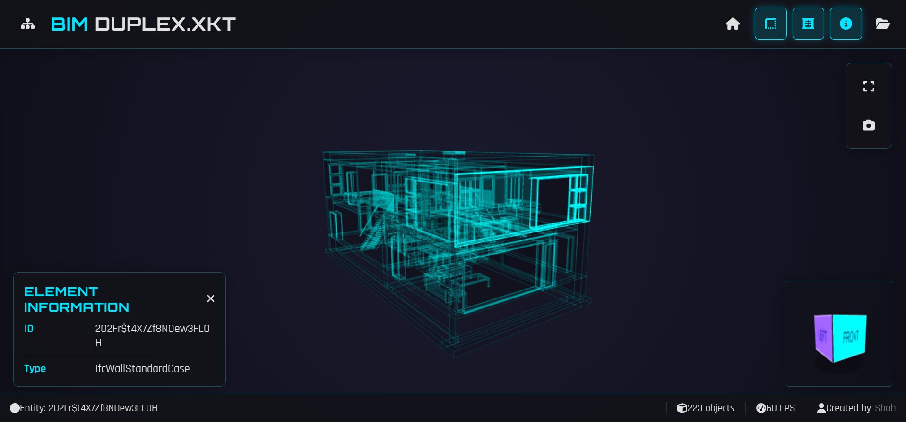

# 🌐 Online XKT Viewer

Online viewer for `.xkt` models built with [xeokit](https://xeokit.io/)!  
Quickly view your BIM models directly in your browser.

🔗 **[Live Demo Here](https://your-demo-link.com](https://xkt-viewer.vercel.app/))**

---

## Features
- Upload and view `.xkt` files instantly
- Fast and lightweight
- No server upload — everything runs locally
- Works on desktop and mobile
- Built with xeokit SDK

---
## 📷 Preview

---

## How to Use
1. Open the [Live Demo](https://your-demo-link.com](https://xkt-viewer.vercel.app/))
2. Drag and drop your `.xkt` file
3. Explore the model in 3D

---

## Acknowledgments
This project uses [xeokit](https://xeokit.io/), a powerful open-source WebGL SDK for BIM and AEC visualization.

